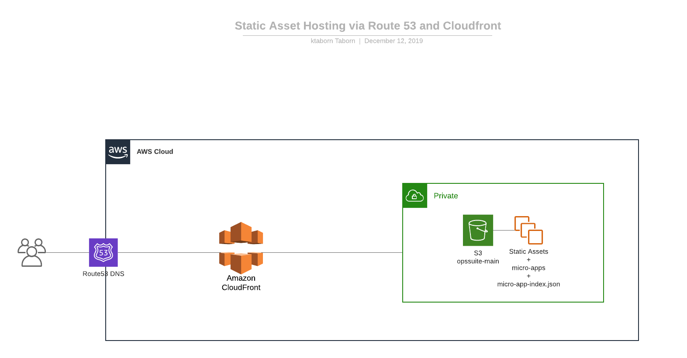
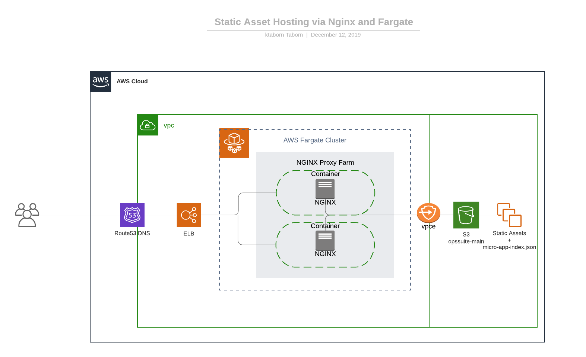

--- 

Serving S3 Assets via Nginx and Fargate

---

Before

---

Redesign

---

Rationale

---

Why

- Performance
- Configurability

---

What

- Nginx
- Docker
- Fargate
- Aws Infrastructure (VPC Endpoint, Load Balancers, Route53)

---

How

- Nginx for ultra-configurability and performance
- Containers for hosting nginx via fargate (added benefit of CI/CD)
- Fargatge for Scale
- VPC and VPC Endpoints for fine-grained access control
- AWS CDK to provision fargate and "plugin" to the existing infrastructure

--- 

Nginx

---

Basic Config

---?code=assets/code/basic-nginx-main.conf

---?code=assets/code/basic-nginx-http.conf

---?code=assets/code/basic-nginx-server.conf

Docker

Basic example using Nginx

---

Full Example

AWS CDK + Cloudformation + Nginx + Docker

All the Things!!!